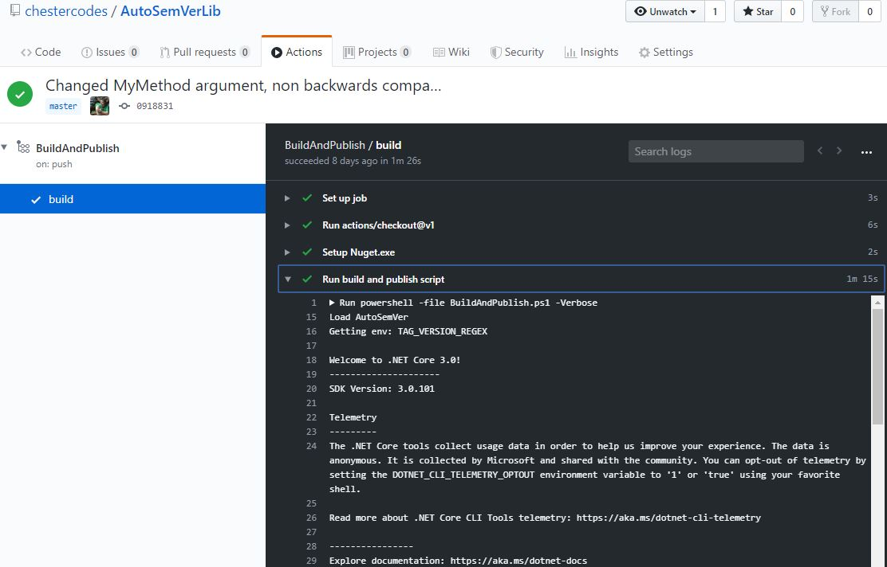
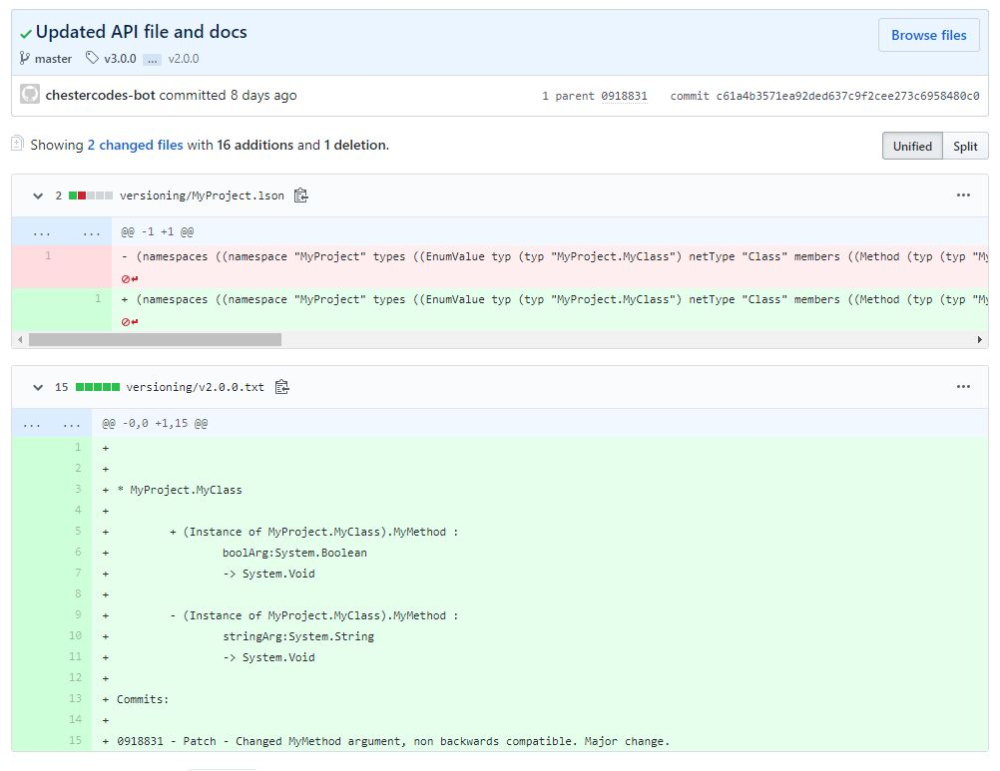

> This is the final post in a series on a method of automating .net library versioning. The [second post describes the proposed automated process](/automating-dotnet-library-versioning-the-process). This post is best understood with familiarity of the previous ones.


GitHub have introduced new platforms for building and hosting software packages. GitHub Actions can be used to build code when pushed to the repository (or with other triggers) and GitHub Package Repository can be used as an artifact store for many types of software packages. 

These services can be used to implement a fully automated CI and publishing pipeline for a `MyProject` nuget package. In this process any commits pushed to the `AutoSemVerLib` [repository](https://github.com/chestercodes/AutoSemVerLib/)'s `master` branch will trigger a GitHub Action to run the `BuildAndPublish.ps1` script. If successful this will build `MyProject` and publish it to the GitHub Package Registry.

### Creating the action

A GitHub Action is created by the inclusion of a `.github/workflow/<SomeName>.yml` file in the base of the GitHub hosted repository. Actions contain steps that form a pipeline, they are executed in a container of a specified os type with [lots of pre-installed software](https://help.github.com/en/actions/automating-your-workflow-with-github-actions/software-installed-on-github-hosted-runners).
The process in `AutoSemVerLib` requires two executables be present, `dotnet` and `powershell`, these are present in the windows hosted runners.

A windows based pipeline `BuildAndPublish` that is triggered by the pushing of commits to the `master` branch and has a single step to checkout the code, can be defined with:

``` yaml
name: BuildAndPublish
on:
  push:
    branches:
      - master
jobs:
  build:
    runs-on: [windows-latest]
    steps:
    - uses: actions/checkout@v1
```

Steps can be shared in the [GitHub marketplace](https://github.com/marketplace?type=actions), there are third party written steps to achieve common build/deployment tasks. 
To push the produced package the pipeline needs to have the `nuget` executable present which can be added with the `warrenbuckley/Setup-Nuget@v1` step. 

``` yaml
    - name: Setup Nuget.exe
      uses: warrenbuckley/Setup-Nuget@v1
```

The `Run build and publish script` step that runs the `BuildAndPublish.ps1` script needs to have environment variables set to configure the execution. These are easily set with the `env` nodes:

``` yaml
    - name: Run build and publish script
      env:
       GIT_TOKEN: ${{ secrets.GIT_TOKEN }}
       TAG_VERSION_REGEX: v(?<Major>\d+).(?<Minor>\d+).(?<Patch>\d+)
       BUILT_NAME_REL: src/bin/Release/netstandard2.0/MyProject.dll
       CURRENT_API_NAME: versioning/MyProject.lson
       GH_USERNAME: chestercodes
       GH_ORG: chestercodes
       GH_REPO: AutoSemVerLib
       GH_EMAIL: chestercodesbot@example.com
       GH_NAME: chestercodes-bot                            
      run: powershell -file BuildAndPublish.ps1 -Verbose
```

The step executes the `run` node, which simply calls the powershell script and will fail the step if there is a non-zero exit code.

The `${{ secrets.GIT_TOKEN }}` is a [GitHub secret](https://help.github.com/en/actions/automating-your-workflow-with-github-actions/creating-and-using-encrypted-secrets) which is a [Personal Access Token](https://help.github.com/en/github/authenticating-to-github/creating-a-personal-access-token-for-the-command-line) created with permissions to be able to push to the repository and package registry. The rest of the environment variables are required to configure the behaviour of the powershell scripts to work with the github repository.

## In Action

When the Action is included in the repo, the pipeline will trigger when code is pushed to the master branch and executions can be seen in the `Actions` tab in the GitHub repo user interface.

The image below shows a successful run of the `BuildAndPublish` pipeline, the steps to checkout the code, install nuget.exe and run the `BuildAndPublish.ps1` script can all be seen with their console output. 




The [commits in the AutoSemVerLib](https://github.com/chestercodes/AutoSemVerLib/commits/master) repo show the process in action. Library changes and documentation can be seen for [Patch](https://github.com/chestercodes/AutoSemVerLib/compare/v1.0.0...v1.0.1), [Minor](https://github.com/chestercodes/AutoSemVerLib/compare/v1.0.1...v1.1.0) and [Major](https://github.com/chestercodes/AutoSemVerLib/compare/v1.1.0...v2.0.0) level magnitude changes to the public API as determined by Syntactic Versioning. The commits also show [Patch](https://github.com/chestercodes/AutoSemVerLib/compare/v2.0.0...v2.0.1), [Minor](https://github.com/chestercodes/AutoSemVerLib/compare/v2.0.1...v2.1.0) and [Major](https://github.com/chestercodes/AutoSemVerLib/compare/v2.1.0...v3.0.0) changes as parsed from the commit messages.

The commit produced by the `chestercodes-bot` after the breaking change to the API is a good example of the output of the process. It shows the increase of the version number by a major version, the new API representation stored in the `MyProject.lson` file and the documentation of the change in the API and the commit message in the `versioning/v2.0.0.txt` file.



## Conclusion

These posts have described a way to automate nuget package versioning. 
A fully automated versioning process is probably not a good idea for public packages with lots of consumers, where introducing breaking changes needs to be thought about very carefully. 

Automating the versioning could be useful where the version magnitude change is less important than ensuring that there's a unique version for library builds. I have worked with a nuget feed that allowed packages to be pushed to it with existing versions when developers forgot to manually change the version. This caused a lot of confusion when trying to reason about the version of code being run in production.

A potential middle ground could be an automation step that:

- builds the code from an intermediary branch (say `develop`)
- calculates the next version number, publishes a `<next>.<version>.<number>-alpha` package
- creates a pull request, to `master` from a new commit with the changes in lson file and documentation

This would provide a nice mixture of automation and manual checking with regards to expected next version number.
