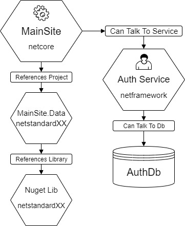
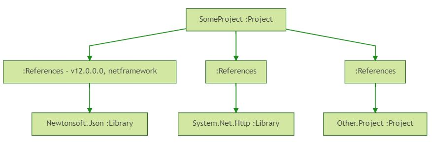
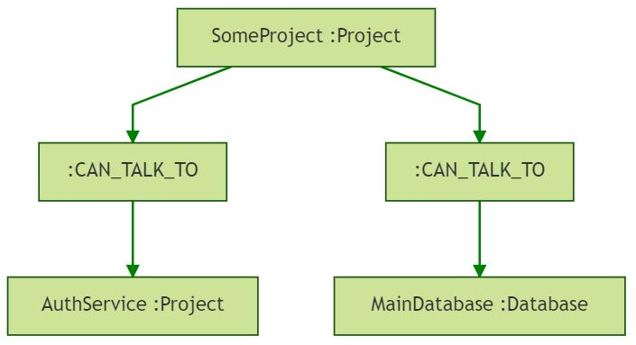
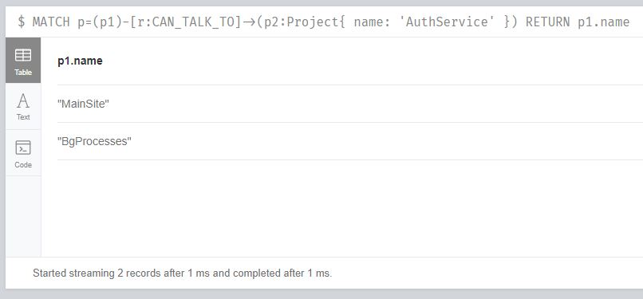
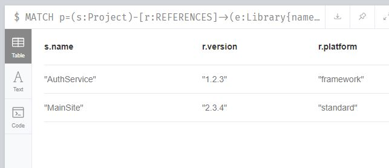
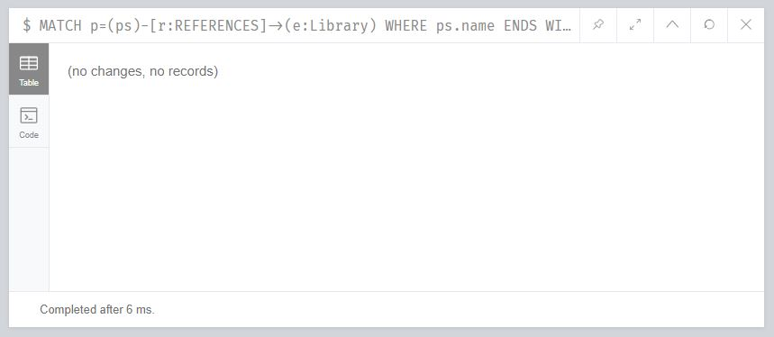

It's common for software platforms to consist of many deployed services that communicate with each other and connect to resources over the network. Each service can be made of one or more code projects that can reference other projects and code libraries. Code projects can be written in different programming languages running on a common runtime.

In the .Net landscape projects can be written in C#, VB.Net and F# and run on one of two runtimes, either .Net Framework (`netframework`) or dotnet core (`netcore`). Projects can reference two types of libraries, .Net Framework (`netXXX`) or .Net Standard (`netstandardXX`) which can be packaged via Nuget or as a part of the runtime.

I participated in a company hackathon just before christmas with the intention of exploring the relationships between the ~50 deployed services, code projects and databases/resources in the platform. The projects are written in either C# or VB.Net and run on either `netframework` or `netcore`. The projects reference external nuget libraries that can be built for either `netstandardXX` or `netXXX`. 

Dependent relationships can be modelled nicely by a graph data structure. Graphs consist of nodes that represent entities and relationships that describe how the entities relate to each other. In this model the nodes are projects, libraries and resources which can reference or talk to each other. An example of the nodes and relationships can be seen in this hypothetical .Net software platform diagram:



The nodes and relationship information can be obtained by cloning all of a platform's code into a directory and scanning this directory with an [F# console app](https://github.com/chestercodes/dependency-visualiser/tree/master/src/ProjectAnalyser). An example of such a platform can be seen in the [dependency-visualiser-example](https://github.com/chestercodes/dependency-visualiser-example) repository.

### Project and library info

The project, library nodes and `REFERENCES` relationships can be derived from the code project files (.csproj, .vbproj, fsproj). These are xml files containing information on the project references and the libraries used in the project. 

Project files take slightly different forms depending on whether they are `netframework` or `netcore` but they contain three types of xml elements. The references between projects are described by the  `ProjectReference` elements. The library references are described by `Reference` for `netframework` and `PackageReference` for `netcore`.
  
An example of the relevant nodes of a `netframework` project file `SomeProject.csproj` can be seen below:

``` xml
<?xml version="1.0" encoding="utf-8"?>
<Project xmlns="http://schemas.microsoft.com/developer/msbuild/2003">
  <ItemGroup>
    <!-- Nuget library reference -->
    <Reference Include="Newtonsoft.Json, Version=12.0.0.0, Culture=neutral, PublicKeyToken=30ad4fe6b2a6aeed, processorArchitecture=MSIL">
      <HintPath>..\packages\Newtonsoft.Json.12.0.2\lib\net45\Newtonsoft.Json.dll</HintPath>
    </Reference>
    
    <!-- Runtime library reference -->
    <Reference Include="System.Net.Http" />
  </ItemGroup>
  
  <ItemGroup>
    <!-- Project reference to other code project -->
    <ProjectReference Include="..\Other.Project\Other.Project.csproj">
      <Project>{560411b0-4899-48d8-9dd1-662874c17f73}</Project>
      <Name>Other.Project</Name>
    </ProjectReference>
  </ItemGroup>
</Project>
```

From this file we can derive the following nodes and relationships:




### Project and resource relationships

The project, resource and `CAN_TALK_TO` relationships can be derived from the configuration files in the project file directories. 
If there are certain files in the directory, such as Web.config, appSettings.json, then the project can be defined as a deployed project. 

Each deployed project's configuration can be parsed for information on how to connect to other defined projects and resources. The lines of each config file will be matched against regular expressions to determine whether it can connect to the resource or project. These regex to resource and project mappings can be defined in a json file:

``` js
{
  "resources": {
    ";Database=MainDatabase;": "MainDatabase"
  },
  "projects": {
    "auth\\.platform\\.com:123": "C:\\allRepos\\auth-service\\src\\AuthService\\AuthService.csproj"
  }
}
```

The appSettings.json file below matches both of the `MainDatabase` and `AuthService` regexs above:

``` js
{
  "ConnectionStrings": {
    "DefaultConnection": "Server=SomeServer;Database=MainDatabase;Trusted_Connection=True;MultipleActiveResultSets=true"
    },
  "AuthServiceUrl": "auth.platform.com:123"
}
```

The config file produces the following relationships:




### Modeling project data

The console application is going to parse the project and config files into nodes and relationships. 

To perform this task it is useful to define the domain. The project nodes can be modelled with:

``` fsharp
type ProjectType = NetFramework | NetCore | NotKnown
type CodeProject = CodeProject of name:string * ProjectType

type DeployedProject = DeployedProject of string

type ProjectNode = 
  | Code     of CodeProject
  | Deployed of DeployedProject
```

The type `CodeProject` wraps a tuple of a `string` labelled `name` and a `ProjectType` which can be either `NetFramework`, `NetCore` or `NotKnown` at that point in the application. The `DeployedProject` type wraps a name and the `ProjectNode` can be one of either project types.

The Libraries can be modelled with:

``` fsharp
type NugetPackageType = Framework | Standard | Unknown
type NugetLib = NugetLib of name:string * version:string * NugetPackageType

type RuntimeLib = RuntimeLib of string

type LibraryNode =
  | Nuget of NugetLib
  | Runtime of RuntimeLib
```

A `NugetLib` contains `name` and `version` strings and a `NugetPackageType` which can be `Framework` (`netXXX`), `Standard` (`netstandardXX`) or `Unknown`. A `LibraryNode` can either be a `NugetLib` or a `RuntimeLib`, which wraps a string of the library name.

The last node type is a `ResourceNode` which wraps a string of the name:

``` fsharp
type ResourceNode = ResourceNode of string
```

The nodes can be either a `Project`, `Library` or `Resource` and can be described by the union:

``` fsharp
type Node = 
  | Project  of ProjectNode
  | Library  of LibraryNode
  | Resource of ResourceNode
```

There are two main types of relationships between the nodes, `REFERENCES` and `CAN_TALK_TO`. The possible start and end nodes types for each relationship are:

  Relationship |   Start node       |  End node
  --------     |   ---------        |   --------
  REFERENCES   |  CodeProject       |  LibraryNode
  REFERENCES   |  CodeProject       |  CodeProject
  CAN_TALK_TO  |  DeployedProject   |  ResourceNode
  CAN_TALK_TO  |  DeployedProject   |  DeployedProject

These can be modelled into the `Relationship` union:

``` fsharp
type Relationship =
  | ProjectReferencesLibrary         of CodeProject     * LibraryNode
  | ProjectReferencesProject         of CodeProject     * CodeProject
  | DeployedProjectCanTalkToOther    of DeployedProject * DeployedProject
  | DeployedProjectCanTalkToResource of DeployedProject * ResourceNode
```

Each case contains a tuple of the correct types for the potential start and end nodes.


### Loading data into neo4j

The console app will parse all of the project files in a directory and output the nodes and relationships into .csv files which can be loaded into neo4j and queried. 

Neo4j is easily run in a docker container and the .csv files can be added to a mounted `import` folder where they will be available to import at the url `file:///<filename>`. An example of using `docker-compose` to run this setup can be seen in the [repository](https://github.com/chestercodes/dependency-visualiser/blob/master/src/Visual/docker-compose.yml). 

With the container running the url `http://localhost:7474` shows the UI and queries can be executed by connecting the web ui to the database.

The `projects.csv` file can import nodes with the label `Project` and properties `name`, `deployed` and `platform` with the query:

``` sql
LOAD CSV WITH HEADERS FROM 'file:///projects.csv' AS line 
CREATE (:Project { name: line.name, deployed: line.deployed, platform: line.platform });
```

The other nodes can be loaded with variations of the above. The relationships can also be loaded in from csv files, the `ProjectReferencesProject` relationships can be loaded in with: 

``` sql
LOAD CSV WITH HEADERS FROM "file:///project_ref_project.csv" AS csvLine
MATCH (s:Project {name: csvLine.start}),(e:Project {name: csvLine.end})
CREATE (s)-[:REFERENCES]->(e);
```

All the required data loading queries can be seen in the [repository](https://github.com/chestercodes/dependency-visualiser/blob/master/src/Visual/LoadData.cql). 


### Project information queries

With all of the nodes and relationships loaded we can get a birds eye of the platform by querying for the nodes:

``` sql
MATCH (n) RETURN n LIMIT 100
```

The query matches the first 100 nodes with any label (Project, Library or Resource) and returns the node to be displayed in the UI, which by default also shows the relationships between the nodes:


Here orange nodes are `Project`s, red nodes are `Library`s and the green nodes are `Resource`s. The arrows between them show the relationships `REFERENCES` and `CAN_TALK_TO`.

The graph can be queried with the `MATCH` keyword, desired properties of the nodes and relationships can be specified using an arrow like syntax. 

``` sql
MATCH p=(sn :MatchLabel)-[r :RELATIONSHIP_TYPE]->(en{prop: 'MatchPropValue'}) 
RETURN p
```

This query looks for results `p` with the start node `sn` of label `MatchLabel`, connected by the relationship `r` of type `RELATIONSHIP_TYPE` to the end node `en` that has the property `prop` with value `MatchPropValue`. 

#### Query - Projects that depend on others

To find out which projects require authentication the graph can be queried for nodes connected by the `CAN_TALK_TO` relationship nodes with `name` equal to `AuthService` and label `Project`:

``` sql
MATCH p=(p1)-[r:CAN_TALK_TO]->(p2:Project{name:'AuthService'}) 
RETURN p1.name
```



#### Query - Library audit

It can be useful to get an a view of the libraries that projects use. If an internal library `Internal.Company.Lib` which targets `netXXX` and `netstandardXX` is used on the platform and a critical bug is fixed in a new version we can write a query to find the projects that consume the library:

``` sql
MATCH p=(s:Project)-[r:REFERENCES]->(e:Library{name:"Internal.Company.Lib"})  
RETURN s.name, r.version, r.platform
```



#### Query - Code convention check

Queries can be written to check for breaking of internal code conventions. It is quite common for code solutions to include a separate project for the domain logic with a name that ends in `.Domain`. It might be useful to keep domain projects free from database or http libraries, such as `Dapper` and `Flurl.Http`. It possible to check for projects that break this convention:

``` sql
MATCH p=(ps)-[r:REFERENCES]->(e:Library)
WHERE ps.name ENDS WITH ".Domain" AND e.name IN ['Dapper', 'Flurl.Http']
RETURN ps.name
```

Running this on the [dependency-visualiser-example](https://github.com/chestercodes/dependency-visualiser-example) repository shows no convention violations.



## Conclusion

This post has shown how a .Net software platform dependencies can be modelled and analysed with F# and neo4j. 
This is my first experience using neo4j and i've been impressed with the intuitive nature of the query language.

The code for the console app [is on github](https://github.com/chestercodes/dependency-visualiser) in case anyone wants to use it to analyse their platforms.