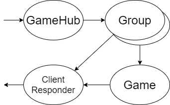

I've wanted to make an application using the SAFE stack for a while and with our new indoor life it seems a good time to make a multiplayer games room.

This also presented a chance to try out using F# with SignalR for client-server communication and Akka.Net for a stateful game server.

### Akka.Net

Akka.Net is a .Net port of the Akka actor framework. Actor frameworks provide useful abstractions to manage the concurrency, state and fault tolerance of applications.

Actors systems consist of actors that communicate asynchronously with immutable messages. Actors can be designed to effectively separate concerns and can manage concurrency by only processing one message at a time.

F# is a great choice for writing Akka.Net applications due to some of it's language features. The language's default immutability, low ceremony record types and pattern matching over discriminated unions make defining and using messages very type-safe and expressive. 

There are currently two libraries that interface with the framework, `Akka.FSharp` and `Akkling`, Akkling offers a slight advantage in type safety. Actors are created by the framework with a props function and an `actor` computation expression.

Defining an actor with Akkling requires specifying the `Msg` type it receives and the props the framework needs to create the actor. 

``` fsharp
type Msg =
    | PrintInt of int
    | PrintString of string

let createPrinterActorProps = props(fun (mailbox: Actor<Msg>) ->
    let rec loop () =
        actor {
            let! msg = mailbox.Receive()
            
            match msg with
            | PrintInt i -> printfn "%i" i
            | PrintString s -> printfn "%s" s
            
            return! loop ()
        }

    loop ()
    )
```

The actor needs an `ActorSystem` to run in and can be created by passing in 
a name to the `spawn` method. `spawn` returns an `IActorRef<Msg>` that can be told a `Msg` with the custom operator `<!`.

``` fsharp 
let system = System.create "my-system" (Configuration.defaultConfig())

let printerActor = spawn system "printer-actor" createPrinterActorProps

printerActor <! PrintInt 1
```

### Games room 

The games room consists of four different types of actors: GameHub, Group, Game and ClientResponder.
The GameHub actor creates Group actors and is the interface for incoming messages from the clients. 
Each Group actor can send messages back to the clients via the ClientResponder actor or to the groups active Game actor.



TODO


### SignalR

SignalR is a solution for painless client-server communication over websockets. An advantage for using F# is that it allows the same DTOs to be used in the client and server code for the transfer of complex objects. 

This was the first time i'd used the library, and the setup on the server-side is the same as C# and is well documented.

SignalR works well with F# objects as long as camelCase is used for property names and the DTOs are simple records that use the `CLIMutable` attribute.
I chose to use the non-native-F# version of types where possible (`array` over `list` being an example) and didn't try to use any discriminated unions.
Sending a `int array` from the client required serialising it to a string as the fable produced object was a simple object, rather than an array.

The client-side setup required a bit of work to produce the fable bindings. The [ts2fable](https://github.com/fable-compiler/ts2fable) tool produced a starting point for the typings that were easily tweaked.

responses cast onto types and then dispatched via a subscription into msg loop

### Conclusion

longer to write

easy to change direction/refactor
