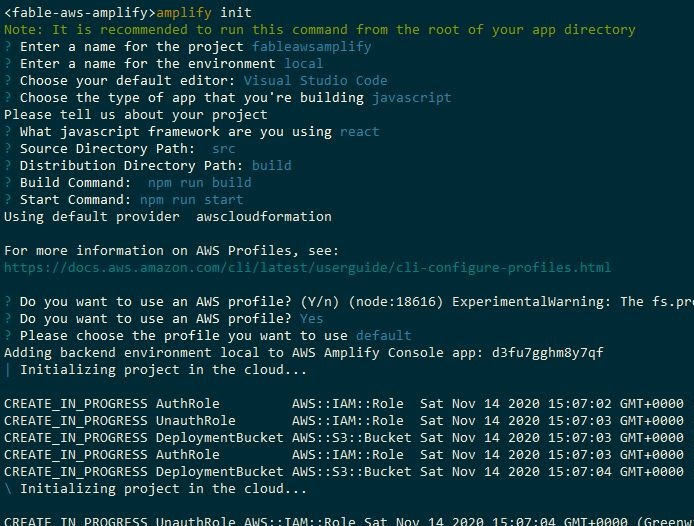
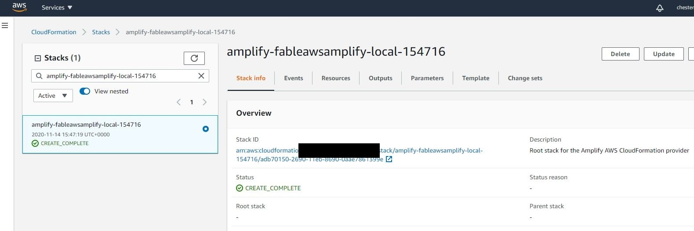
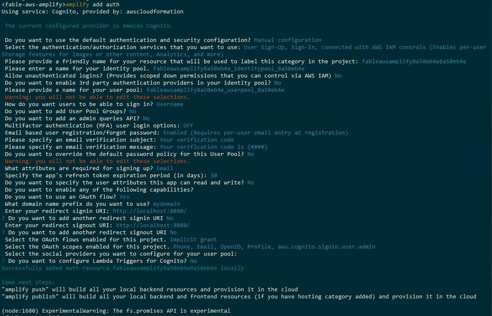
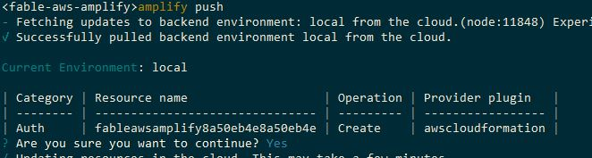
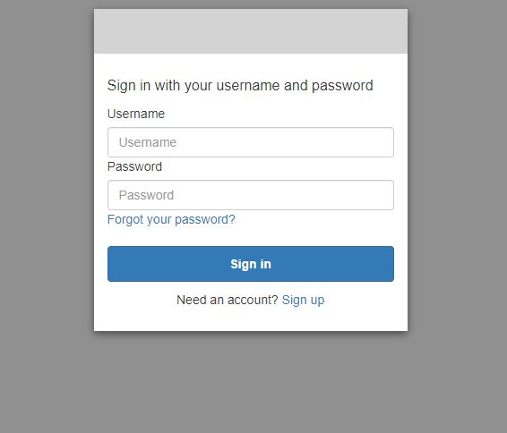
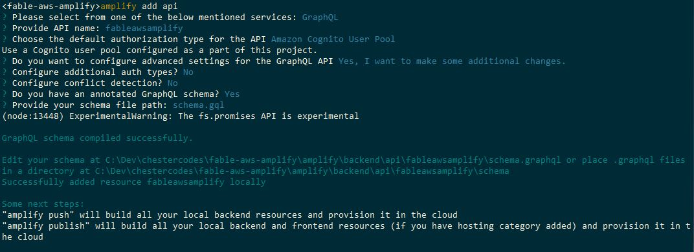
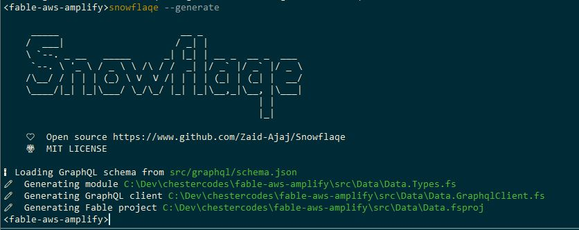
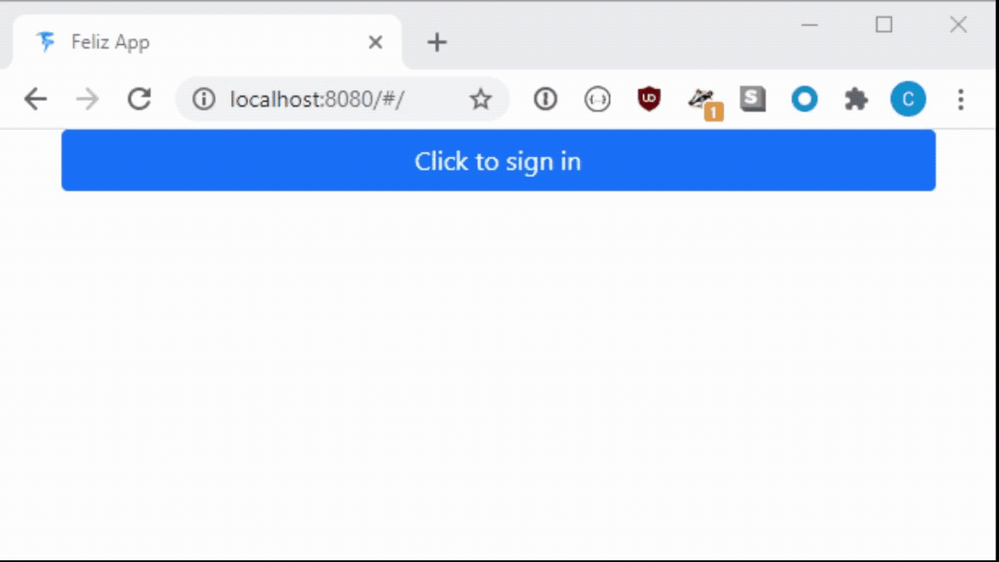

> This is an entry for the [F# Advent Calendar 2020](https://sergeytihon.com/tag/fsadvent), please consider checking out some of the other awesome blog posts.

Modern cloud platforms offer developers a level of productivity that would have been inconceivable a couple of decades ago. Managed services provide solutions for aspects of web development including user identity and notifications, backend APIs and persistence, web hosting and analytics.

Service variety has led to technology exposure and learning curve becoming a problem. Cloud providers have started producing tools such as Google Firebase and AWS Amplify to accelerate development by abstracting app creation. These tools provide easier user interfaces to generate code that stitches their cloud services together. 

---

AWS Amplify is a combination of developer cli, CI/CD service, and client SDK libraries for web and mobile. It allows developers to quickly scaffold applications using building blocks that correspond to application needs. 

The plugins include ([but are not limited to](https://docs.amplify.aws/cli/plugins)):

 Category | Purpose
 ---      | ---
 auth     | Adds user authentication to an application using AWS Cognito
 api      | Adds a scalable GraphQL backend API using AWS AppSync and DynamoDB
 storage  | Adds file and app data storage with AWS S3 and DynamoDB
 function | Add custom functionality using AWS Lambda


Amplify supports Javascript and Typescript as languages, but can be used with any technology that can be transformed into Javascript. 
This blog post details how to create a simple todo list app with user authentication, authorisation and data persistence. 

---

## F# and fable

F# is a fantastic general purpose programming language. The combination of strong type system and [sensible defaults](https://medium.com/better-programming/modern-languages-suck-ad21cbc8a57c) leads to a very pleasing developer experience. 

It's also got a user base which punches well above its weight in producing cool tech, an example of which is Fable. Fable is a set of technologies that enable the compilation of F# into Javascript. It allows applications written in F# to run in browsers and leverage the massive npm ecosystem.

Fable apps are typically written with a Model-View-Update library called Elmish that offers a nice separation of concerns. The Model and Update parts of the app are easily testable pure F# functions and the View is a function that renders the app state into html. 


I want to use F# to level up the type safety of my todo list app and will use the [Feliz dotnet template](https://zaid-ajaj.github.io/Feliz/#/Feliz/ProjectTemplate) as a base.

---

## amplify init

AWS Amplify is primarily used via the `amplify` cli. It is a fast changing, [open source](https://github.com/aws-amplify/amplify-cli) project, that is distributed via a [npm global tool](https://docs.amplify.aws/cli/start/install#install-the-amplify-cli). Once installed and configured with access to an AWS account, we can start using amplify with the app. The project repository needs to be initialised with the command:

```
amplify init
```

The cli then asks a few questions about the project, it first asks for a project name and initial environment name as well as the type of project. It then asks for some info that the amplify CI/CD services need, including commands to build the project and the output location. The amplify cli is designed to work with multiple environments, `local` is chosen to show the app during development.

Amplify will then create a few AWS resources including IAM roles and an S3 bucket to store project data and deployment artifacts.



Once the `init` is finished the project resources are visible from cloudformation. The resource stack includes the project name, environment and time created:



With the project initialised it's possible to add other features with the cli.
amplify stores state about the services that a project uses alongside the code in an `amplify` directory. `amplify init` adds config related to the editor type chosen and AWS resources added by the init call. These resources are environment specific and need to be checked into source control. 

---

## auth

AWS cognito is a service that provides user authentication and access control. Cognito makes it easy to implement user sign-up, password reset with a customisable hosted UI.
amplify has an `auth` plugin that will create a hosted UI with AWS cognito when added to the project:

``` bash
# format is amplify add <plugin>
amplify add auth
```

`amplify` will then ask questions to get the desired configuration of AWS Cognito. There are a lot of options presented and the cli changes fairly regularly, so they may not be the same as seen here. The important choices to make are:

- Choose manual configuration
- No unauthenticated logins
- Sign-in by Username
- Enable registration/password reset
- Email required for signing up
- Want to use an OAuth flow
- - Redirect sign-in to `http://localhost:8080/`
- - Implicit grant flow
- - All OAuth scopes

These and the other current choices can be seen below:



When the add command has finished, the project enters a new unpublished state. The changes required to create all of the `auth` resources are present in the `amplify` directory but no change has taken place in AWS. The changes can then be inspected locally, and if necessary removed, without potentially breaking anything external of the repository. If the changes are satisfactory then the resources can be created with:

```
amplify push
```



The cli shows the changes to be made, in this case creating the auth resource, and asks whether to proceed. If yes is chosen it continues to create the resources:


If all succeeds then it displays a link to test the url that is of the format 

```
https://<domainPrefix>-<environment>.auth.<awsRegion>.amazoncognito.com/login?response_type=token&client_id=<clientId>&redirect_uri=http://localhost:8080/
```

Navigating to this link shows the AWS Incognito hosted portal, allowing user sign-up etc. 



A user signing in to an account redirects the browser to a url that can be parsed for the OAuth tokens.

```
<signInRedirectUrl>/#id_token=XXX&access_token=XXX&expires_in=3600&token_type=Bearer
```

Adding the `auth` category also creates a new file in the code directory named `aws-exports.js`. This file contains a javascript object of environment specific configuration, relating to the amplify components that have been added. 

The above steps show how simple amplify makes creating the user account part of the app using AWS Cognito

---

## api

Users need a secure place for data to be persisted and retrieved.
amplify has an `api` category to add a GraphQL API using AWS AppSync. AppSync is a managed service that makes it easy to create a scalable hosted API using DynamoDB tables for data storage and AWS Lambda for GraphQL resolvers.

An API is defined using a GraphQL schema and [special directives](https://docs.amplify.aws/cli/graphql-transformer/directives) that indicate properties of the API, such as table relationships and authorisation requirements. There are many amplify directives, a few of the ones relavent to the app are:

 Name        | Description
 ---         | ---
 @model      | Type is persisted with corresponding DynamoDB table
 @key        | Set indexing structure for type and table
 @auth       | Define API authorisation rules for type and fields
 @connection | Define relationships between @models

A user can have multiple todo lists, each with a `name` and multiple `tasks`, each task belongs to a list and has a `title`. For the app the schema is defined in a `schema.gql` file containing:

``` graphql
type TodoList @model @auth(rules: [{ allow: owner }]) {
  id: ID!
  name: String!
  owner: String
  tasks: [TodoTask] @connection(keyName: "byTodoList", fields: ["id"])
}

type TodoTask @model @key(name: "byTodoList", fields: ["todoListID"]) @auth(rules: [
    { allow: owner }
    ]){
  id: ID!
  title: String!
  todoListID: ID!
  owner: String
  todoList: TodoList @connection(fields: ["todoListID"])
}
```

The API needs two tables, each defined with a the `@model` directive, the `TodoList` type creates the table for the lists and the `TodoTask` type for the tasks. Both types contain an `@auth` directive that describes the authorisation needed to access the data, in this case this is limited to the `owner`, which is a keyword to describe the user that created the data. 

The `TodoTask` table contains a `@key` and the relationship between the tables is shown by the `@connection` that links the `TodoTask.id` with the `TodoList.tasks` property.

With the schema defined upfront the amplify cli can be used to create the `api` with the command `amplify add api`:



`amplify` asks some questions relating to the API creation, the important points for the app are currently:

- GraphQL type of API
- authorisation type `Amazon Cognito User Pool`
- The existing annotated schema is present at `schema.gql`

After the call to `amplify push` the cli will ask a few more questions relating to code generation. The cli offers to create the Create/Update/Delete queries, mutations and subscriptions for the @model types, in either `javascript` or `typescript`. This feature saves some key-strokes and can also be used multiple times as the schema evolves as it saves the settings in a `.graphqlconfig.yml` in the repository.

`javascript` code generation is useful for the purposes of the app, the generated files (`queries.js`, `mutations.js` and `subscriptions.js`) can be imported and used from F# code with fable. Part of the cli generated `queries.js` is shown:

``` js
/* eslint-disable */
// this is an auto generated file. This will be overwritten

export const listTodoLists = /* GraphQL */ `
  query ListTodoLists(
    $filter: ModelTodoListFilterInput
    $limit: Int
    $nextToken: String
  ) {
    listTodoLists(filter: $filter, limit: $limit, nextToken: $nextToken) {
      items {
        id
        name
        owner
        createdAt
        updatedAt
      }
      nextToken
    }
  }
`;

// plus the list and get queries for TodoList and TodoTask
// ...
```


---

## Using javascript code in fable

Consuming javascript from fable involves describing the type shape and location of the code. To use the generated `listTodoLists` query string that is exported from the `graphql/queries.js` file:

``` fsharp
// define F# type that contains string properties with the same names as exported
type Queries =
    abstract listTodoLists: string with get, set
    // ... other exported queries in file

// use the Import attribute with the javascript locater and special jsNative keyword
let [<Import("*","graphql/queries")>] queries: Queries = jsNative

// string values now accessible from `queries` object
Fable.Core.JS.console.log(queries.listTodoLists)
```

Running the above will print the amplify generated client query. It's also important to be able to use libraries from npm, this process is the same as the above where the exported types are defined and the library imported. The library that interacts with AppSync requires the query to be passed to a function exported by the `graphql-tag` library:

``` fsharp
type GraphQLTag = interface end

// import function from lib
let [<Import("*","graphql-tag")>] gql: string -> GraphQLTag = jsNative

// call gql to get value to pass to AppSync js client
let query = gql(queries.listTodoLists)
```

The F# types can also be generated using the [ts2fable](https://github.com/fable-compiler/ts2fable) tool which works well for a lot of libraries.

---

## Initial data query

With the AppSync API created, the amplify cli also generates a `schema.json` file that describes the API schema. This file contains type information on the shape of the queries that the API expects, which can be used for query validation. 

The generated client queries don't include one that retrieves both the user's lists and tasks. The initial data loading for the app can be done with a query saved to `gql/InitLists.gql`.

``` graphql
query InitLists {
  listTodoLists {
    items {
      id
      name
      owner
      tasks {
        items {
          id
          title
        }
      }
    }
  }
}
```

This query can be validated against the `schema.json` with a tool called [Snowflaqe](https://github.com/Zaid-Ajaj/Snowflaqe). Snowflaqe is a dotnet tool that can read a schema file and perform two useful tricks:

- Read all `.gql` files in a directory and validate queries for type/name errors
- Generate F# types to be used with a GraphQL API

Snowflaqe is configured with a json file, here the properties relevant to the app are described:

``` json
{
    // path to the generated schema json file
    "schema": "src/graphql/schema.json",
    // directory to look for queries to validate
    "queries": "src/gql",
    // F# project name to contain generated types
    "project": "Data",
    // directory for generated F# project 
    "output": "src/Data"
}
```

Snowflaqe can be invoked with the command `snowflaqe --generate`:  



The command output shows a few generated files in the `src/Data` directory, the `Data.Types.fs` file contains types for the objects that the API expects for data transfer and query filtering. An example of the types generated is the `ModelTodoListFilterInput` required for the `ListTodoLists` query:

``` fsharp
type ModelTodoListFilterInput =
    { id: Option<ModelIDInput>
      name: Option<ModelStringInput>
      owner: Option<ModelStringInput>
      ``and``: Option<list<Option<ModelTodoListFilterInput>>>
      ``or``: Option<list<Option<ModelTodoListFilterInput>>>
      not: Option<ModelTodoListFilterInput> }
```

## AWS AppSync client

The [AWS AppSync javascript client](https://github.com/awslabs/aws-mobile-appsync-sdk-js) is the easiest way to consume the API from the app.
Using the client from fable involves importing the `aws-appsync` package from npm and creating types for the initialisation. The client creation types are a bit too involved for this post, but can be [seen in the project repo](https://github.com/chestercodes/fable-aws-amplify/blob/main/src/types/AwsAppsync.fs).

The client can be used in a similar way to a REST API, with the data being returned from the `query` and `mutate` methods. The data structures for input and filtering are generated by snowflaqe, but the types for the data returned for each resolver need to defined.

It's also possible to use the client with GraphQL subscriptions. This requires making the same `query` and `mutate` client calls but waiting for subscriptions to feedback the persisted data changes to the app. 

There are advantages to both methods but I chose to use the subscription method of feeding back the data as the `Elmish` app framework has a useful way to setup subscriptions. A simplified version of setting up the `onCreateTodoList` subscription using the client is shown below:

``` fsharp
open Fable.Core.JS

// define types for data returned by subscription
type TodoListModel =
    abstract id: string with get, set
    abstract name: string with get, set
type OnCreateTodoList =
    abstract onCreateTodoList: TodoListModel with get, set
type DataResponse<'T> =
    abstract data: 'T with get, set

// define type for subscribe input and create object
type SubscriptionQuery = { query: GraphQLTag; variables: Object option }
let onCreateTodoListQueryInput = Some (createObj [ "owner" ==> username ])

// create query from amplify generated code
let onCreateTodoListQuery = gql subscriptions.onCreateTodoList

// define function to be invoked when subscription triggered
let onCreateTodoListNext = fun (x: DataResponse<OnCreateTodoList>) -> 
  console.log("List created named " + x.data.onCreateTodoList.name)

// create subscription using appsync client
let onCreateTodoList = client.subscribe ({
  query = onCreateTodoListQuery
  variables = onCreateTodoListQueryInput }).subscribe ({ 
    next = onCreateTodoListNext
    error = fun err -> console.log err })

```

Subscriptions can be setup for the main Create/Update/Delete methods of each of the `@model` types and provide a centralised place to report the apps persisted state as it changes.

---

With the data retrievable from the API, the rest of the app code can be written and seen running below. The list names and task titles are randomly generated with types of lists and tasks.

The main features of the app shown:

- User clicks on sign in and is directed to AWS Cognito hosted site
- User signs in and is directed to app which takes credentials from url and calls api for initial data
- Initial data returns empty and user creates and deletes lists and tasks with the model being updated by subscriptions.





I've uploaded the [application code to github for those interested](https://github.com/chestercodes/fable-aws-amplify). 

---

## Conclusion


AWS Amplify is an ambitious attempt to speed up app development by providing abstractions over common AWS service setups. Overall I think it is a useful tool that strikes a good balance between ease and control.
I'm not sure how the experience will scale to more than one developer or whether the tool is the best choice for a long lasting project. My description of the amplify cli feature set is far from complete and those interested should [consult the docs](https://aws.amazon.com/amplify/).

The choice of language for a new project is always hard, especially [between F# and typescript](https://thomasbandt.com/type-safe-spa-fable-fsharp-vs-typescript) which benefits from a huge user base and provides enough type safety for most.
The main advantage of using F# for front-end development is client-server code sharing, which isn't applicable here, but I think that the language features, type-system and refactoring experience make it a great choice. 

After finishing the code for this post I realised that when the amplify cli is used to generate typescript it generates code for the [API interaction.](https://medium.com/@dantasfiles/using-typescript-with-aws-amplify-api-3788d722869)
The generated `API.ts` file contains types for the query objects and the data returned by the API resolvers. Converting this typescript file to F# with the `ts2fable` tool removes the need for the snowflaqe generation step and most of the manual type definitions.