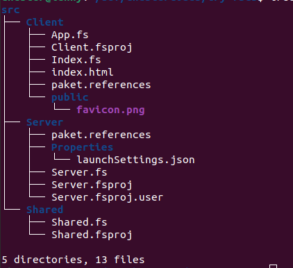
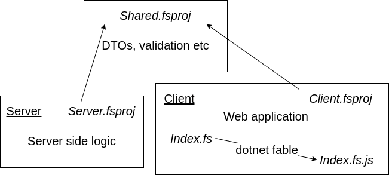
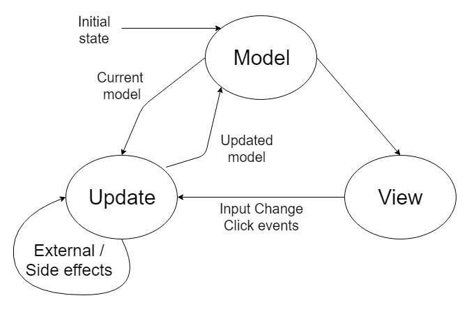
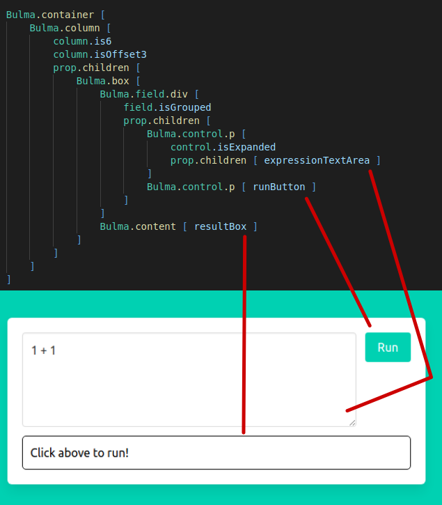
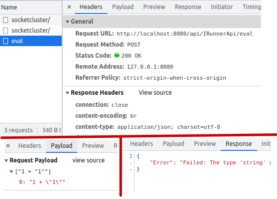

> This is an entry for the [F# Advent Calendar 2021](https://sergeytihon.com/2021/10/18/f-advent-calendar-2021/), please consider checking out some of the other awesome blog posts.


`FSharp.Compiler.Services` is a nuget package that contains tools for implementing F# language bindings. It is mostly used for developer tools but also contains APIs for dynamic execution of F# code. 

[SAFE Stack](https://safe-stack.github.io/) is a `dotnet new` template that allows web applications to be written in F# and run on the server and browser. Server side code runs with the dotnet runtime and client side code is [transpiled into Javascript with fable](https://fable.io/).

Interactive code runners like [try.dot.net](https://try.dot.net/) are an easy way to start learning a programming language. They speed up the process by executing code in a web browser, removing the need to install any software onto your computer.
Combining FSCS and the SAFE stack we can easily create an F# interactive code running web application.

---

## FSharp.Compiler.Services


There are two main ways to run dynamic F# code with the package, either using the `fsc` executable to compile the code and import the created `.dll` file or creating a F# interactive session with the `fsi` executable and passing it commands to evaluate.

The code runner app is going to use the `fsi` executable on the server and pass results back to the browser. The [documentation](https://fsharp.github.io/fsharp-compiler-docs/fcs/interactive.html#Interactive-Service-Embedding-F-Interactive) describes how to create an interactive session with FSCS and the `dotnet` executable can be used instead by prefixing the initial arguments with `fsi`.

To use the FSCS library, add a package reference in the `.fsproj` file:

``` xml
<PackageReference Include="FSharp.Compiler.Service" Version="40.0.0" />
```

An fsi evaluation session needs a `TextReader` and couple of `TextWriter` objects for the input and output streams. These can be encapsulated in a `FsiExpressionEvaluator` type:

``` fsharp
open System
open System.IO
open System.Text
open FSharp.Compiler.Interactive.Shell

type FsiExpressionEvaluator() =
    // Initialize output and input streams
    let sbOut = new StringBuilder()
    let sbErr = new StringBuilder()
    let inStream = new StringReader("")
    let outStream = new StringWriter(sbOut)
    let errStream = new StringWriter(sbErr)
    ...
```

Still within the type, can create an `fsi` session with `FsiEvaluationSession.Create()`, the streams, default configuration and other arguments (`fsi`, `--noninteractive`):

``` fsharp
    // differs across platforms
    let dotnetLocation = Environment.GetEnvironmentVariable("DOTNET_ROOT")

    // Build command line arguments & start FSI session
    let allArgs = [| dotnetLocation; "fsi"; "--noninteractive" |]
    let fsiConfig = FsiEvaluationSession.GetDefaultConfiguration()
    
    let fsiSession =
        FsiEvaluationSession.Create(fsiConfig, allArgs, inStream, outStream, errStream)
    ...
```

With the session initialised, add an `Evaluate` method that takes a `string` expression and returns a `Result<string, string>` of either the compilation error or value.

``` fsharp
    member this.Evaluate(expression: string) =
        let result, warnings = fsiSession.EvalExpressionNonThrowing(expression)
        match result with
        // successful execution
        | Choice1Of2 valueOrUnit ->
            let expressionValue = 
                match valueOrUnit with
                // return value as string
                | Some fsharpValue -> sprintf "%A" fsharpValue.ReflectionValue
                // unit value, return blank string
                | None -> ""
            Ok expressionValue
        // execution failed
        | Choice2Of2 _ ->
            // join list of error messages into string
            let messages =
                warnings
                |> Array.map (fun x -> x.Message)
                |> fun arr -> String.Join(", ", arr)

            sprintf "Failed: %s" messages |> Error
```

The `FsiExpressionEvaluator` type allows the execution of F# code dynamically via an `fsi` session. 
The code runner app will use this type to evaluate user generated expressions and display the output or compiler errors.

---

## Web app

Creating the web application involves installing the SAFE stack [project template and creating a new project](https://safe-stack.github.io/docs/quickstart/). This creates the files needed to build the Client and Server components with the application code files stored in the `src` directory.



The template creates three F# projects for the Shared, Server and Client code with the latter two depending on the `Shared.fsproj`. The project is setup to build the server code with `dotnet`, transpile the F# to Javascript with fable and bundle the client side code with webpack.



### Shared code

The shared code project is a dependency of both the client and server projects and can be used for data transfer objects and validation code.
Client-Server communication is achieved with the `Fable.Remoting` [RPC library](https://zaid-ajaj.github.io/Fable.Remoting/) with the route and contract defined in the shared code.

The client sends an expression in the form of a string and the server either returns the result of the expression if the code is ok, or returns the compiler errors if the code does not compile. The `Shared.fs` file shows the required code to achieve this in an `eval` procedure:

``` fsharp
namespace Shared

module Route =
    let builder typeName methodName = sprintf "/api/%s/%s" typeName methodName

// type aliases for clarity/documentation
type Expression = string
type EvalValue = string
type EvalError = string
type EvalResult = Result<EvalValue, EvalError>

// used by Fable.Remoting to define communication
type IRunnerApi =
    {
        eval: Expression -> Async<EvalResult>
    }
```

### Client

The browser app is written in F# that is transpiled into Javascript.
The SAFE stack template implements a simple application written in the MVU architectural pattern using the [Elmish library](https://elmish.github.io/elmish/) which can be tweaked to make the code runner.

MVU stands for Model View Update, the model contains all of the possible states of the application as a data structure. The view is a function that takes the model as an argument and returns the UI to be rendered to the user who can then perform actions that dispatch messages. Update is a function that takes messages from the UI and returns an updated model to be rendered.



The app needs to store the expression to be evaluated and the response from the api. It responds to three different events: changing the expression text, run the expression and update the model from the response of the api. These can be codified with:


``` fsharp
open Shared

type Model = {
    Expression: string
    Response: EvalResult
}

type Msg =
    // Run button is pressed
    | EvaluateExpression
    // Expression text is changed
    | UpdateExpression of Expression
    // Received a response from api
    | GotResponse of EvalResult
```

The `Model` and `Msg` are used by the `view` and `update` functions and specify the possible application states and events. The `update` function takes the `Msg` and current `Model` and returns a tuple of the new `Model` and a command object for Elmish to run.

``` fsharp
open Fable.Remoting.Client

// use Fable.Remoting and Shared.fs code to create object to call api
let runnerApi =
    Remoting.createApi ()
    |> Remoting.withRouteBuilder Route.builder
    |> Remoting.buildProxy<IRunnerApi>

let update (msg: Msg) (model: Model) : Model * Cmd<Msg> =
    match msg with
    | EvaluateExpression ->
        // create command that sends expression to api and calls back to GotResponse
        let evaluateExpressionOnServer =
            Cmd.OfAsync.perform runnerApi.eval model.Expression GotResponse
        model, evaluateExpressionOnServer
    | GotResponse res ->
        // update the model with api response
        { model with Response = res }, Cmd.none
    | UpdateExpression expression ->
        // text area changed, update the model with new value
        { model with Expression = expression }, Cmd.none
```

The `Msg` type allows the compiler to check the completeness of the pattern matching on the `msg` value to ensure that all of the events are handled.

The `view` function takes the `Model` and a function to dispatch new `Msg` objects from the UI. The return value is a [reactjs](https://reactjs.org/) component that is defined with the [Feliz](https://zaid-ajaj.github.io/Feliz/) library, and `Feliz.Bulma` is used to create [Bulma UI components](https://bulma.io/).

The app needs to display the expression, a "Run" button and the result from `eval` in a box that is either coloured red or black depending on response.

``` fsharp
// model is type Model, dispatch is function (Msg -> unit)

let resultBox =
    // text and text colour from the EvalResult
    let (result, colour) =
        match model.Response with
        | Ok ok -> ok, "black"
        | Error err -> err, "red"

    // add a p element with border
    Html.div [
        prop.style [
            style.padding 10
            style.border (1, borderStyle.double, colour)
            style.borderRadius 5
        ]
        prop.children [
            Html.p [
                prop.style [ style.color colour ]
                prop.text result
            ]
        ]
    ]

// editable textarea that dispatches UpdateExpression message when changed
let expressionTextArea =
    Bulma.textarea [
        prop.value model.Expression
        prop.onChange (fun x -> dispatch (UpdateExpression x))
    ]

// button that sends expression to api when clicked
let runButton =
    Bulma.button.a [
        color.isPrimary
        prop.onClick (fun _ -> dispatch EvaluateExpression)
        prop.text "Run"
    ]
```

The values `resultBox`, `expressionTextArea` and `runButton` are F# values with type `ReactElement` and can be inserted within other layout:



## Server side

The SAFE template uses the [Saturn framework](https://saturnframework.org/) to create the API. Saturn is built on top of ASP.NET Core and provides useful abstractions and utilities for creating modern web APIs. 

The server side code needs to implement the `IRunbookApi` contract and then Fable.Remoting can implement an app for Saturn to run.

``` fsharp
let evaluator = FsiExpressionEvaluator()

open Shared

// implement shared api contract
let runnerApi: IRunnerApi =
    { 
        eval = fun expression ->
            async {
                return evaluator.Evaluate expression
            }
    }

open Fable.Remoting.Server
open Fable.Remoting.Giraffe

// create Fable.Remoting api from IRunnerApi and shared route builder
let fableRemotingApi =
    Remoting.createApi ()
    |> Remoting.withRouteBuilder Route.builder
    |> Remoting.fromValue runnerApi
    |> Remoting.buildHttpHandler

open Saturn

// create saturn app and run
let app =
    application {
        url "http://0.0.0.0:8085"
        use_router fableRemotingApi
        memory_cache
        use_static "public"
        use_gzip
    }

run app
```

With the server setup it's possible to see `Fable.Remoting` in action and the request and response if the expression `1 + 1` is evaluated:


And a compiler error if the expression `1 + "1"` is sent:




## Conclusion

This post has shown how to use FSCS and SAFE stack to create an interactive code runner web app. The code can be seen [on my github](https://github.com/chestercodes/try-fscs) for anyone who is interested.

Using an interactive session with fsi is one of the ways to use FSCS, but it is probably not the best solution for embedding user defined code in an application. There are a couple of blog posts ([here](https://queil.net/2021/05/embedding-fsharp-compiler/) and [here](https://www.jamesdrandall.com/posts/compiling_and_executing_fsharp_dynamically_at_runtime/)) that describe how to use `fsc` to run dynamic F# code in an application which might be more appropriate.

The SAFE Stack is a great combination of technologies that reduces the time that it takes to start a new project. It's very useful to be able to use the same code on the client and server and also check the application correctness with the F# compiler.