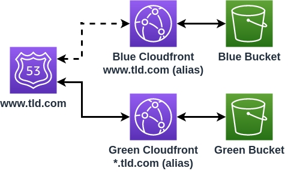
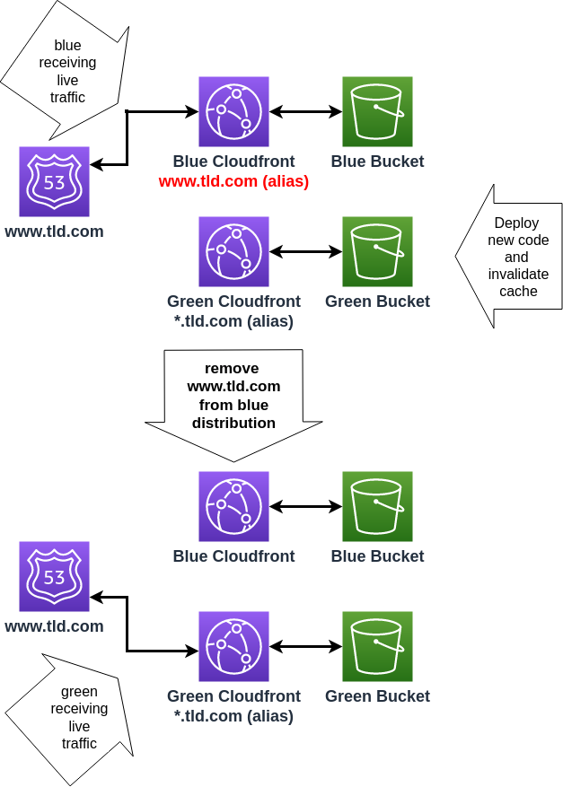
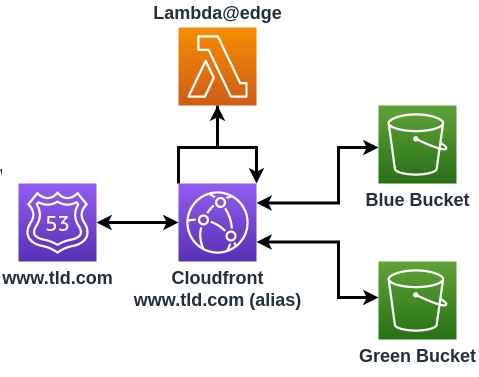
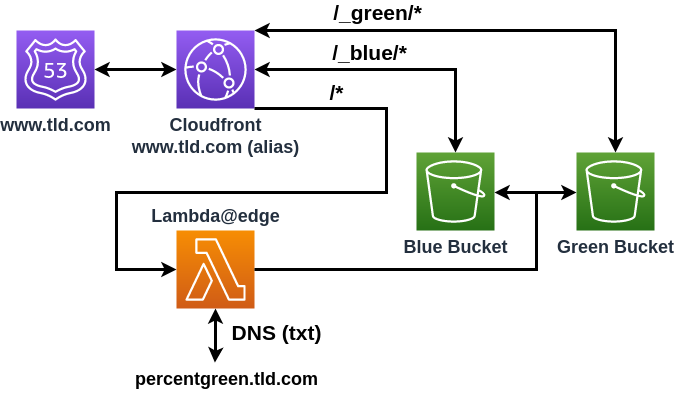
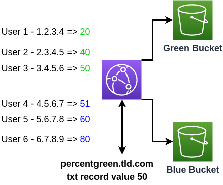

Amazon CloudFront is a global content delivery network (CDN) service built for high-speed, low-latency performance, security, and developer ease-of-use. 

I recently finished a static site project ([that you should check out](https://life-cal.com)), hosted by AWS Cloudfront.
I choose a simple implementation, but was interested to see how hard it would be to implement more advanced patterns. This post describes a couple of options on how to implement green/blue deployments with AWS Cloudfront.

The [Green/Blue deployment pattern](https://martinfowler.com/bliki/BlueGreenDeployment.html) consists of two identical production environments, named green and blue, with a router distributing web traffic between the two.
One of the advantages of this pattern, is that it allows applications to be deployed with minimal-to-no down time enabling high-availability application changes. This pattern also enables incremental deployments by gradually increasing the traffic from the old colour to the new.

For a static site, a common pattern is for Cloudfront to cache files that are hosted by S3. Green/Blue deployments involve routing traffic between the green and blue source buckets.
There are a few ways of achieving this, I explored the following:

- using two Cloudfront distributions, each with a corresponding S3 bucket, with Route 53 switching traffic between them
- using one distribution and using an Lambda@edge function to route traffic between two origins

## Two distributions

The simpler solution is to use two Cloudfront distributions and switch the traffic using Cloudfront configuration.
Cloudfront has a technical limitation in that it can't have a specific DNS alias on more than one distribution. To be able to use the alias `www.tld.com` on more than one cloudfront instance we need to resort to a bit of a hack and assign `www.tld.com` to the blue instance and `*.tld.com` to the green instance:

Cloudfront will route traffic to the instance that has the alias `www.tld.com` irrespective of where the Route 53 DNS record is targeting. Adding or removing the `www.tld.com` domain from the blue instance will act to switch the traffic between the blue and green distributions.

When the blue site is live, deploying a green version of the application involves updating the S3 bucket, invalidating the distribution cache and then removing the `www.tld.com` alias from the blue distribution. The config changes can take up to an hour to propagate fully, but in my experience the site change is seen within a minute or two.

It isn't possible to have gradual releases with this method, the release will be a switch of all traffic from blue to green.
A code example for this setup, deployed by the AWS CDK, can be seen in the [github repo](https://github.com/chestercodes/cdk-cloudfront-blue-green/tree/main/lib/two-cf) for this post.

## One distribution

A slightly more complex implementation uses a single Cloudfront distribution and routes the traffic dynamically between the buckets.

Cloudfront can execute [Lambda@Edge functions](https://docs.aws.amazon.com/lambda/latest/dg/lambda-edge.html) at specific events when dealing with requests and responses. The events are:

- After CloudFront receives a request from a viewer (`viewer request`)
- Before CloudFront forwards the request to the origin (`origin request`)
- After CloudFront receives the response from the origin (`origin response`)
- Before CloudFront forwards the response to the viewer (`viewer response`)

[picture source](https://docs.aws.amazon.com/lambda/latest/dg/lambda-edge.html)

A lambda invoked at the `origin request` event can be used to change the origin domain and switch between the blue and green buckets.
It can be useful to access each colour at it's own origin for smoke testing and other debugging purposes. Traffic to the base url of `www.tld.com/_<colour>/` can be routed to the matching `<colour>` bucket. 
Requests to `www.tld.com/*` will be dynamically routed to the green or blue bucket, decided by logic in the lambda function.

The routing location is decided by hashing the user's IP address and converting it to a number between 1 - 100. 
This number will be consistent each time the specific user accesses the site, and can be compared to a value representing the weighting percentage of traffic to be routed to the green site. 
The value can be stored in Route 53 DNS as a txt record at `percentgreen.tld.com`. If the value computed from the user's IP address is bigger than the percentage green value then the user traffic will be sent to the blue bucket.

Switching the traffic involves changing the value of the DNS record, and can be done in increments of 1% at the rate that Route 53 can change `txt` DNS records.
This method of traffic routing easily enables incremental deployments or can be used as a switch by limiting the DNS record values to 0 and 100.
Code for this example can be found on github in the [repo associated with this post](https://github.com/chestercodes/cdk-cloudfront-blue-green/tree/main/lib/one-cf).

## Conclusion

This post has shown a couple of ways that Cloudfront can be used to implement Green/Blue deployments.
The Lambda@Edge functionality is very useful for adding a layer of programmability to Cloudfront which can have a wide range of use cases.

Example code for this post can be found on [my Github](https://github.com/chestercodes/cdk-cloudfront-blue-green) for those interested.