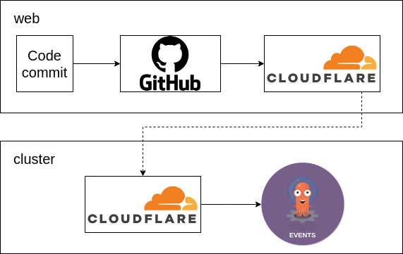

Over the last couple of months, inspired by a [few](https://www.youtube.com/@justmeandopensource) [youtube](https://www.youtube.com/@TechnoTim) [channels](https://www.youtube.com/@DevOpsToolkit), i've been trying to implement a kubernetes based developer homelab.

My goal was to be able to be able to build, deploy, securely host and monitor a basic web application `MyWebApp` that accesses a database.
I wanted all of the functionality to be a part of the homelab, with the exception of Github for code hosting and Cloudflare for ingress traffic.

## k3s(/d)

I first needed a kubernetes cluster, there are a few ways to run kubernetes in a non-cloud environment, one of them is [k3s](https://k3s.io/).
K3s is a Kubernetes distribution that has been optimized for small and resource-constrained environments. It's designed to be lightweight, easy to install, and requires fewer system resources than a full-fledged Kubernetes cluster.
It is highly customisable and comes with a local storage provider, service load balancer, Helm controller and traefik as an ingress controller.

In addition to the running homelab, I wanted to be able to develop new changes on my laptop. Running a k3s cluster on a laptop is easily done with a tool called [k3d](https://k3d.io/). k3d is a command line tool that can create kubernetes clusters using docker containers, performing all of the networking setup and cluster customisation. clusters can be created from configuration files or command line arguments as easily as:

```
k3d cluster create mycluster
```

## build

I needed a way to build `MyWebApp` when code is changed, there are a few kubernetes based CI options, and I chose a combination of Argo Events and Argo Workflows. When commits are pushed, Github will trigger a webhook to a Cloudflare hosted domain, the tunnel will direct this request into the cluster to an argo events source:



The events source will receive the webhook and trigger an Argo workflow to build the app. 
The workflow uses Kaniko to build the apps Dockerfile and push the image to an cluster hosted docker registry:


## deploy

With the `MyWebApp` image built it's ready to be deployed. ArgoCD is a great technology to deploy containers in kubernetes, whether these are a version of `MyWebApp` or the other applications in the cluster.

ArgoCD is best used with the GitOps methodology, which means that deploying a new version of a container is usually a case of updating a version in a git repo and waiting for the change to occur. 
In my case this work is done by a workflow triggered by the successful build. 

I created a continuous deployment pipeline that spins up a new copy of the environment in a new namespace and runs integration tests to check for regressions before deploying the code to production. 
This will be explained in more detail in a further blog post.

## host

[Cloudflare tunnels](https://developers.cloudflare.com/cloudflare-one/connections/connect-apps) can also be used as a secure method of traffic ingress for hosting `MyWebApp`. 
To achieve this need to run `cloudflared` containers run in the cluster and recieve traffic that is tunneled from a domain that I own in cloudflare. Cloudflare makes this easy to create these tunnels with their `cloudflared` cli:

```
cloudflared tunnel login
cloudflared tunnel create mypersonaltldcom
cloudflared tunnel route dns mypersonaltldcom mywebapp.mypersonaltld.com
```

k3s uses traefik as the default ingress operator and sending requests from the `cloudflared` containers to `traefik.kube-system.svc.cluster.local` will let traefik route the requests to `MyWebApp` via it's ingress rules:


## monitor

kubernetes has a lot of options for monitoring applications, it makes it easy to gather logs, metrics and traces from all parts of the cluster. I chose to use loki to aggregate logs from each of the nodes, prometheus to gather metrics and jaeger to recieve and reconcile traces. grafana can also be used to add dashboards for the cluster.


## conclusion

This has been a simple explanation of some of the code that I use in my homelab. All of the code can be viewed on my github at the following repositories:

- [homelab-cluster](https://github.com/chestercodes/homelab-cluster) - main apps used in the cluster
- [homelab-apps](https://github.com/chestercodes/homelab-apps) - repo containing the tunnel config, pipeline code and deployed manifests and versions
- [homelab-ping](https://github.com/chestercodes/homelab-ping) - repo that contains the example web app
- [homelab-maindb](https://github.com/chestercodes/homelab-maindb) - repo that contains code for deploying a postgres database

