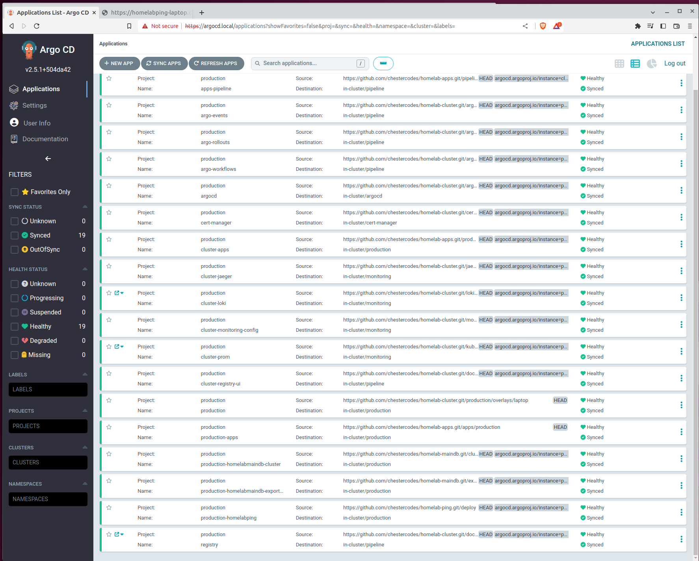

One of the advantages of using kubernetes and a container orchestration platform is that it can be cheaap and fast to spin up services to meet demand.
Previously creating a new instance of a service would involve creating a new VM and installing any required dependencies in a timescale of minutes, with a container orchestration it can be as little time as downloading the image plus a few seconds to start the container.

It is important to have a deplyment pipeline that can test changes in a staging environment before deploying them to production.
This helps to prevent major problems from arising and minimizes the risk of downtime and system failures.
With kubernetes it is feasible to incorporate the creation and then deletion of an environment specifically for the purpose of testing a new change.

This blog post describes a method of using the Argo Projects to implement a deployment pipeline that creates ephemeral environments to test changes before destroying them.

