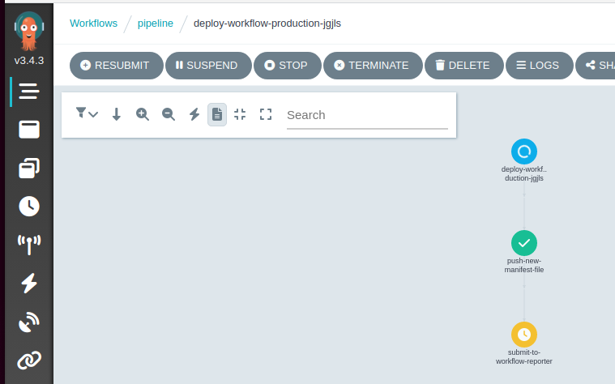

It is important to have a deployment pipeline that can test changes in a staging environment before deploying them to production.
This helps to prevent major problems from arising and minimizes the risk of downtime and system failures.
With kubernetes it is feasible to incorporate the creation and then deletion of an environment specifically for the purpose of testing a new change.
Another method of avoiding downtime for services is to use canary deployments to gradually deploy changes and while testing for failures.

This blog post describes a method of using the Argo Projects to implement a deployment pipeline that creates ephemeral environments to test changes before destroying them and rolls out services with canary deployments.

## method

The app to be changed is a small web service with a `/ping` route that returns the value `pong` as text:

The change to be made is to change this output to a complex value `{ 'value': 'pong' }`

When the commit is pushed to GitHub, a webhook is triggered that is picked up by an Argo Events source which then triggers an Argo Workflow to build the app:

This workflow first decides a timestamped version for the change and then builds two images, one for the app and one for the code that the pipeline uses:

The logs from the `version` task show the change version `v202301211170844`:

The logs show the app being built:

The CI stage builds an image for the app (`apps/homelabping:v202301211170844`) and an image for the code that the pipeline to use (`pipeline/homelabping:v202301211170844`).
The pipeline image contains any code for database migrations and functional tests.

With the images built and pushed, the workflow triggers another workflow to start the deployment to a staging environment:

Each staging environment is spun up for a particular change of an app, in this case the app is the `homelabping` for the version `v202301211170844`.
The first action is to create the new environment, this is done by creating a manifest file in a git repository to be picked up by ArgoCD.

The `push-new-manifest-file` task clones the apps repo and creates a new file with the versions to be deployed at the path `apps/staging/manifests/v202301211170844.json`.
ArgoCD searches for files in the pattern `apps/staging/manifests/*.json` and will then detect the new manifest file and create a new staging environment.

As well as the application being changed there are others to be deployed in the staging environment for the automated tests.
The new manifest is a copy of the current production manifest file but with the new versions for the `homelabping` app. 
In addition to the `v202301211170844` build of the app, the git hash of the changed repo is used as a version for the deployment of the helm chart that generates the kubernetes manifests.

When the file has been pushed to github the pipeline runs the `submit-to-workflow-reporter` task which sets up a workflow-reporter API to expect a REST API call to indicate whether each project in the new staging environment has successfully deployed, or failed. The pipeline then enters a `wait-completion` task until the workflow-reporter tells it to carry on, or fail the pipeline.

After about a minute or so (or manual triggering) ArgoCD will pickup the new staging file and create the new environment from the application versions. Below shows an app-of-apps called `v202301211170844-apps` which deploys the other applications with the versions from the `apps/staging/manifests/v202301211170844.json` file:

One of the other apps to be deployed is a postgres database: 

When this has successfully deployed (i.e. ArgoCDs `sync` has finished) jobs run to firstly setup the database users and then call to the `workflow-reporter` api to report a successful deploy for the `homelabmaindbcluster` app.

When all of the apps have reported successful deployments the pipeline resumes and runs the migrations and then the functional tests located in the `pipeline/homelabping:v202301211170844` image.

If the tests pass we can be sure that the change to the homelabping app hasn't caused any regressions in functionality and the last task of the pipeline is to trigger another workflow to deploy to production.

With the deployment to production started, the pipeline updates the production manifest to the new `homelabping` versions and removes the previous staging environment (this probably should be done at the end of the staging pipeline really):

The pipeline tells the workflow reporter about the apps being deployed and pauses at the `wait-completion` step:

With the production manifest changed in the git repo, ArgoCD starts a canary deployment of `homelabping` using Argo Rollouts. First a replica set of the new version is created:

Then the rollout is paused while an Argo Rollout analysisrun is created and setup from the `maintain-success-rate` analysistemplate. The template contains information on how to test whether the canary deployment is to be considered a success, in this case by querying prometheus for metrics:

The analysisrun deployment shows information on the state of the measurements:

While the canary progresses along the stages of release, the likelihood of requests being directed at the new change increases and we can see the new response:

When the rollout is complete all of the traffic is directed to the pods with the new app version and the successful sync job runs to tell the workflow-reporter to tell the pipeline to resume:

The migrations and tests run and the pipeline completes.

As the `apps/staging/manifests/v202301211170844.json` file was deleted the `v202301211170844` environment tears itself down leaving no trace.

## conclusion

This post has demonstrated a novel way of using the Argo projects to deploy code changes safely with ephemeral environments and canary deployments.

In practice this approach might be a bit overkill and prone to transient errors, but it's interesting to think of the possibilities that kubernetes allows for creating short lived environments.

All of the code for this post is on my github, spread out over a few repos:

- [homelab-apps](https://github.com/chestercodes/homelab-apps) - repo containing pipeline code and deployed manifests and versions
- [homelab-ping](https://github.com/chestercodes/homelab-ping) - repo that contains the homelabping app
- [homelab-maindb](https://github.com/chestercodes/homelab-maindb) - repo that contains code for deploying a postgres database
- [homelab-cluster](https://github.com/chestercodes/homelab-cluster) - main apps used in the cluster for monitoring etc
